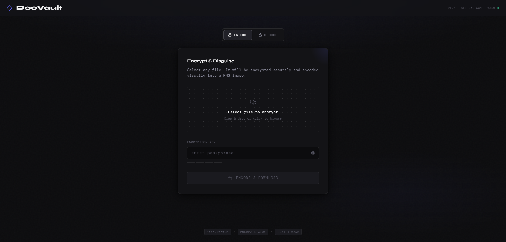

<p align="center">
  
  
  
  
</p>

# 🔐 DocVault

*Your files, disguised.*

**DocVault** disguises any document as a PNG image or AVI video using **AES-256-GCM** encryption. It allows you to store sensitive documents in cloud services that only accept photos or videos. The cloud provider never sees your actual content. The application executes 100% client-side via **Rust** and **WebAssembly**. Your files never leave your device. The encoded output appears as visual noise and remains indecipherable without the exact password.

Recent robustness work tightened error handling, improved cleanup of WebAssembly-backed objects during encode/decode flows, and added stricter validation for extracted AVI frame dimensions during restore.

## Preview

<!-- Add a screenshot here -->


The DocVault interface encoding a sensitive document into a secure, disguised PNG image.

## How It Works

```text
ENCODE                              DECODE
──────                              ──────
📄 document.pdf                     🖼️  document.vault.png
      │                              (or 🎬 document.vault.avi)
      ▼                                       │
 AES-256-GCM                         Read RGB Pixels
 Encryption                          (from PNG or AVI frames)
      │                                       │
      ▼                                       ▼
 Byte → RGB                          Extract Metadata
 1024×1024 Frames                    (salt, IV, filename, frame count)
      │                                       │
      ▼                                       ▼
 ≤1 frame → 🖼️ .vault.png           AES-256-GCM
 >1 frame → 🎬 .vault.avi           Decryption
  (MPNG lossless codec)                       │
                                              ▼
                                      📄 document.pdf ✓
```

Each 3 bytes of encrypted data map to one **RGB pixel**. All frames are fixed at **1024×1024 pixels**. Files that fit in a single frame (~≤3 MB) produce a PNG. Larger files are split across multiple frames and packaged into an **AVI video** using the lossless **MPNG (Motion PNG)** codec. DocVault embeds **metadata** including the `salt`, `IV`, `filename`, and `total_frames` in the first pixels.

## Features

| Feature | Description | Detail |
|---------|-------------|--------|
| **AES-256-GCM** | Authenticated encryption mode. | Guarantees confidentiality and prevents tampering. |
| **PBKDF2** | Secure key derivation. | Executes `310,000` iterations to thwart brute-force attacks. |
| **Zero Server** | 100% client-side processing. | Makes zero network requests and completely lacks telemetry. |
| **Rust Core** | High-performance WebAssembly engine. | Delivers native-like cryptographic speeds inside your browser. |
| **Adaptive Output** | PNG or AVI video output. | Creates a single 1024×1024 PNG for files ≤ ~3 MB, or a multi-frame AVI video (MPNG lossless codec) for larger files. |
| **Batch Encoding** | Encode multiple files at once. | Select multiple files, encrypt them all with one password. Per-file progress tracking with individual and bulk download. |
| **Lossless Recovery** | Exact byte-for-byte decryption. | Returns your original file with the exact original filename. |
| **Robust Decoding** | Stricter container validation. | Rejects malformed AVI inputs more clearly and validates extracted frame dimensions before multi-frame decode. |
| **Self-Contained** | Metadata travels with pixels. | Requires no external database or key files. |
| **Open Source** | Fully verifiable code. | Uses the MIT license for absolute transparency. |

## Security

### Encryption
DocVault encrypts your file using **AES-256-GCM**, an authenticated encryption mode. The authentication tag guarantees that nobody altered or corrupted the ciphertext. Providing a wrong password surfaces a clear authentication mismatch error. The engine never produces garbled output.

### Key Derivation
DocVault derives the encryption key using **PBKDF2-HMAC-SHA256** with `310,000` iterations. This high iteration count meets OWASP 2023 recommendations. It makes brute-force attacks computationally expensive. The engine generates a random 256-bit `salt` for every single file.

### What DocVault Does NOT Protect Against

⚠️ **Limitations:**
- Does not hide the fact that a PNG or AVI file exists.
- Security depends entirely on your password strength.
- The encoded output requires more storage than the original file.
- We have not formally audited this software.

## Getting Started

### Prerequisites
- Rust (1.70+): `curl --proto '=https' --tlsv1.2 -sSf https://sh.rustup.rs | sh`
- wasm-pack: `cargo install wasm-pack`
- Rust WASM target: `rustup target add wasm32-unknown-unknown`
- Node.js 18+ and npm 9+

### Installation & Build

```bash
# 1. Clone the repository
git clone https://github.com/yourusername/docvault.git
cd docvault

# 2. Build the Rust core → WebAssembly
cd crates/docvault-core
wasm-pack build --target web --out-dir pkg

# 3. Install frontend dependencies
cd ../../web
npm install

# 4. Start the development server
npm run dev
```

Then open `http://localhost:5173`.

### Production Build

```bash
cd web
npm run build
# Output → web/dist/ (deploy to any static host)
```

## Project Structure

```text
docvault/
├── crates/
│   └── docvault-core/        # Rust crate (compiles to WASM)
│       └── src/
│           ├── lib.rs        # wasm-bindgen exports (v1.1.0)
│           ├── crypto.rs     # AES-256-GCM + PBKDF2
│           ├── encoder.rs    # Fixed 1024×1024 multi-frame encoding
│           ├── decoder.rs    # Single-frame & multi-frame decoding
│           └── metadata.rs   # VaultMetadata (276 bytes, includes total_frames)
└── web/                      # React + Vite frontend
    └── src/
        ├── hooks/
        │   └── useDocVault.ts    # WASM bridge hook (PNG + AVI flows)
        ├── utils/
        │   └── aviMuxer.ts       # AVI muxer/parser (MPNG lossless codec)
        └── components/           # UI components
```

## Usage

### Encoding Files
1. Open DocVault in your browser
2. Click **Encode** tab
3. Drag & drop or select one or more files (batch encoding supported)
4. Enter a strong password
5. Click **Encode & Download** (single file) or **Encode N Files** (batch)
6. For small files (≤ ~3 MB): saves as `.vault.png`
7. For larger files: saves as `.vault.avi` (playable in VLC)
8. In batch mode, each file shows individual progress and a download button; click **Download All** when finished

### Decoding a File
1. Open DocVault
2. Click **Decode** tab
3. Drop the `.vault.png` or `.vault.avi` file you previously encoded
4. Enter the same password
5. Click **Decode & Restore**
6. Your original file downloads automatically

DocVault now performs stricter validation during restore:
- standard PNG decodes continue through the single-frame path
- AVI restores validate that extracted frames match the expected fixed `1024×1024` format before decryption
- malformed or non-DocVault AVI inputs fail earlier with clearer errors instead of proceeding with ambiguous decode behavior

> ⚠️ **Password Warning:** There is no password recovery mechanism. If you forget your password, the file cannot be recovered. Store your password safely.

> 📝 **Note:** The encoded output uses more storage than the original file due to pixel padding and PNG/AVI container overhead.

## Built With

| Technology | Purpose | Version |
|------------|---------|---------|
| **Rust** | Core cryptography and encoding engine | 1.70+ |
| **wasm-pack** | WASM compilation and packaging | Latest |
| **wasm-bindgen** | JavaScript to Rust interop | Latest |
| **ring** | Cryptographic primitives (AES, PBKDF2) | Latest |
| **React** | Interactive user interface | 18.x |
| **TypeScript** | Type-safe frontend logic | 5.x |
| **Vite** | Frontend bundling and development server | 5.x |
| **Tailwind CSS** | Styling and layout system | 3.x |
| **serde-wasm-bindgen**| Data serialization across the WASM boundary | Latest |

## Roadmap

- [x] AES-256-GCM file encoding to PNG
- [x] PBKDF2 key derivation with 310K iterations
- [x] Fixed 1024×1024 frame encoding with multi-frame support
- [x] AVI video output (MPNG lossless codec) for large files
- [x] React + WASM browser app
- [x] Batch encoding (multiple files at once)
- [ ] CLI tool (native Rust binary, same core)
- [ ] Filename obfuscation option
- [ ] Drag-to-reorder encoded image collections
- [ ] Desktop app (Tauri wrapper)

## Contributing

We welcome issues and pull requests on the GitHub repository. This project uses Rust for the core and React for the UI. Familiarity with `wasm-bindgen` is extremely helpful for core contributions.

### Recent Fixes
- fixed frontend error-message handling so encode/decode failures surface the intended message consistently
- narrowed AVI detection in the decode flow to avoid treating arbitrary `.avi` files as DocVault containers too eagerly
- added safer cleanup patterns around WebAssembly-backed encode/decode results to reduce the risk of leaked Rust-side allocations
- released image bitmap resources after pixel extraction in browser decode flows
- added guards against invalid empty-frame AVI construction
- added validation for extracted AVI frame dimensions before multi-frame decryption

## License

Distributed under the MIT License. See `LICENSE` for more information.

## Disclaimer

DocVault represents a personal utility tool. Security professionals have not independently audited this software. Do not use it as your sole protection for critically sensitive data. The author holds no responsibility for any data loss resulting from forgotten passwords or software bugs.
